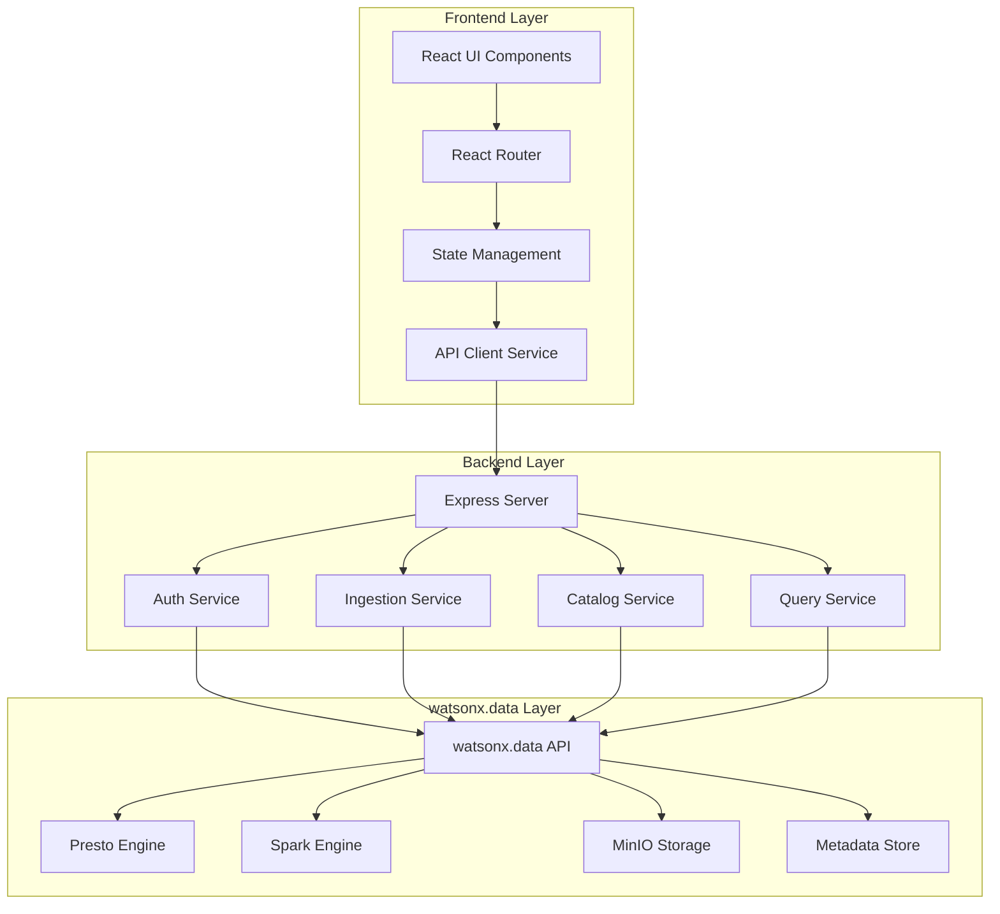
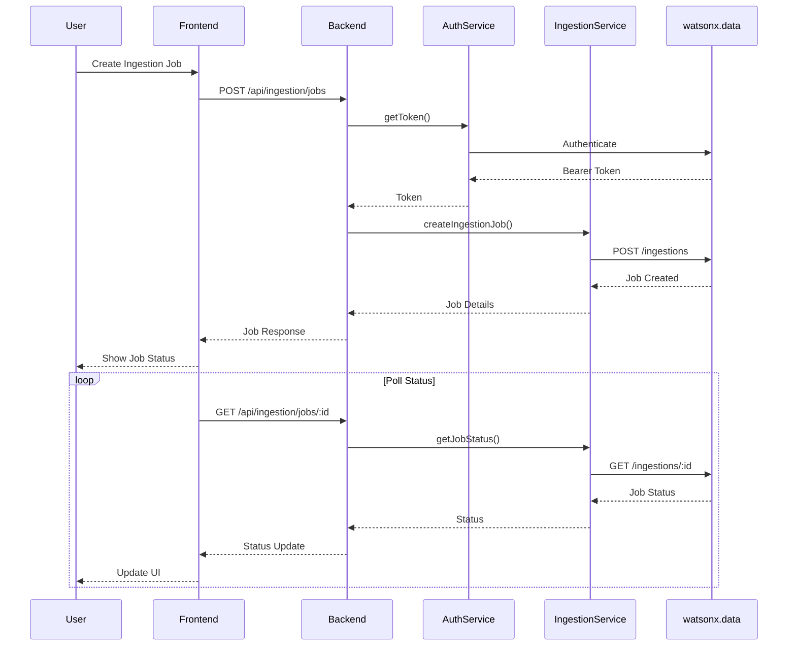
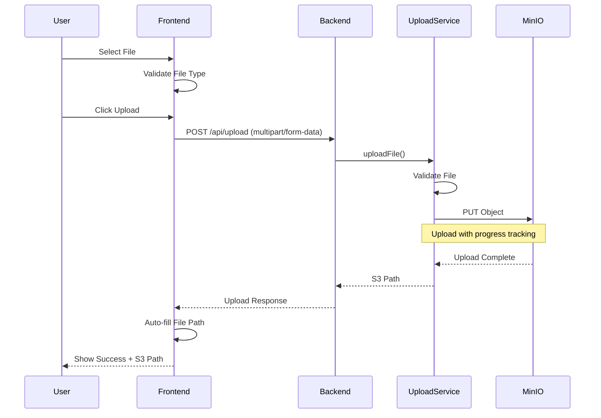
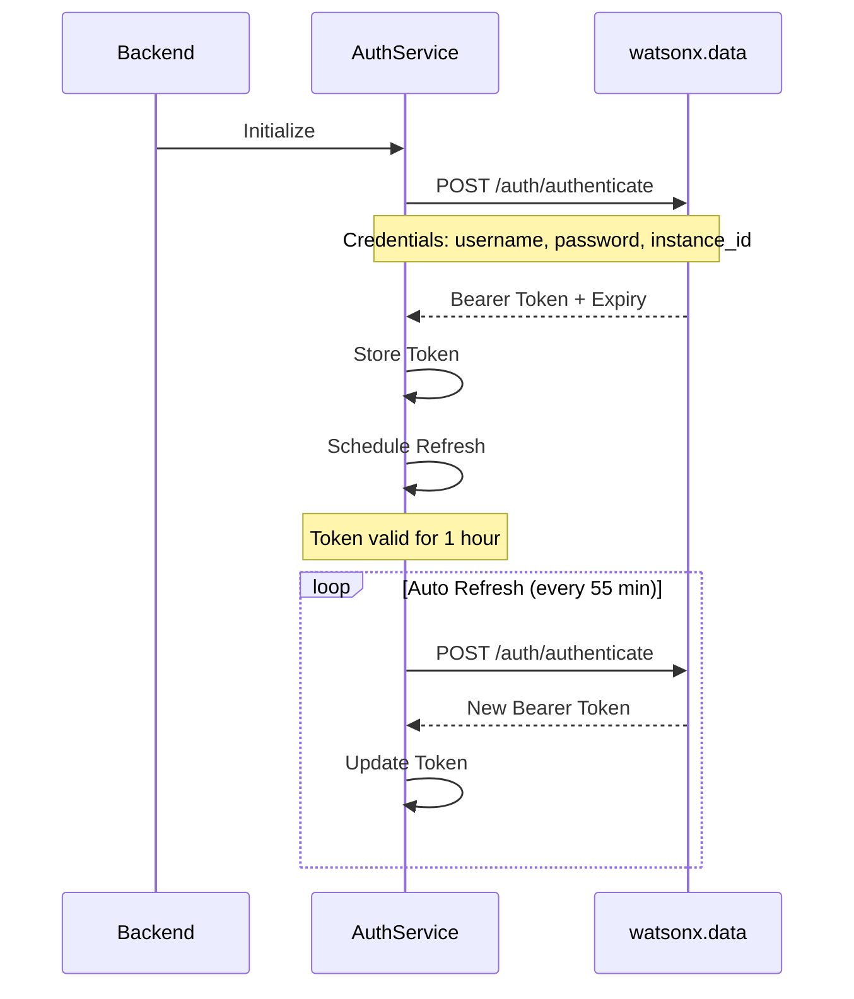

# watsonx.data Demo Application - Architecture Documentation

## Table of Contents
1. [Overview](#overview)
2. [System Architecture](#system-architecture)
3. [Component Details](#component-details)
4. [Data Flow](#data-flow)
5. [API Integration](#api-integration)
6. [Security](#security)
7. [Scalability](#scalability)

## Overview

The watsonx.data Demo Application is a full-stack web application designed to demonstrate the capabilities of IBM watsonx.data Developer Edition. It provides an intuitive interface for data ingestion, catalog management, and query execution.

### Technology Stack

**Backend:**
- Node.js v18+
- Express.js (REST API framework)
- Axios (HTTP client)
- Multer (File upload handling)
- AWS SDK S3 Client (MinIO/S3 integration)
- Winston (Logging)
- Helmet (Security)

**Frontend:**
- React 18
- Material-UI (MUI)
- React Router (Navigation)
- Axios (API client)
- Recharts (Data visualization)

**Infrastructure:**
- watsonx.data Developer Edition
- MinIO (Object storage)
- Presto/Spark (Query engines)
- Docker (Containerization)
- Kubernetes (Orchestration)

## System Architecture

### High-Level Architecture

```
┌─────────────────────────────────────────────────────────────────┐
│                         Client Browser                          │
│                     (React Application)                         │
└────────────────────────────┬────────────────────────────────────┘
                             │ HTTP/HTTPS
                             │ Port 3000
                             │
┌────────────────────────────▼────────────────────────────────────┐
│                      Frontend Server                            │
│                    (React Dev Server)                           │
│  ┌──────────────────────────────────────────────────────────┐  │
│  │  Components:                                             │  │
│  │  - Dashboard    - Catalog Mgmt    - Ingestion UI        │  │
│  │  - Query UI     - Job Monitor     - Monitoring          │  │
│  └──────────────────────────────────────────────────────────┘  │
└────────────────────────────┬────────────────────────────────────┘
                             │ REST API
                             │ Port 5001
                             │
┌────────────────────────────▼────────────────────────────────────┐
│                       Backend API Server                        │
│                      (Express.js/Node.js)                       │
│  ┌──────────────────────────────────────────────────────────┐  │
│  │  Services:                                               │  │
│  │  - Auth Service      - Catalog Service (CRUD)           │  │
│  │  - Ingestion Service - Query Service (SQL)              │  │
│  │  - Upload Service    - Monitoring Service               │  │
│  └──────────────────────────────────────────────────────────┘  │
│  ┌──────────────────────────────────────────────────────────┐  │
│  │  Middleware:                                             │  │
│  │  - Authentication    - Rate Limiting                    │  │
│  │  - Error Handling    - Request Logging                 │  │
│  └──────────────────────────────────────────────────────────┘  │
└────────────────────────────┬────────────────────────────────────┘
                             │ HTTPS/REST
                             │ Port 6443
                             │
┌────────────────────────────▼────────────────────────────────────┐
│                  watsonx.data Developer Edition                 │
│  ┌──────────────────────────────────────────────────────────┐  │
│  │  Core Components:                                        │  │
│  │  - Presto Engine     - Spark Engine                     │  │
│  │  - Iceberg Catalog   - Hive Catalog                     │  │
│  │  - MinIO Storage     - Metadata Service                 │  │
│  └──────────────────────────────────────────────────────────┘  │
└─────────────────────────────────────────────────────────────────┘
```

### Component Architecture



## Component Details

### Frontend Components

#### 1. Dashboard Component
- **Purpose**: Main landing page showing system overview
- **Features**:
  - System health status
  - Recent ingestion jobs
  - Quick actions
  - Performance metrics

#### 2. Ingestion Component
- **Purpose**: Create and manage data ingestion jobs
- **Features**:
  - File upload interface
  - S3/MinIO path configuration
  - Target catalog/schema/table selection
  - Engine configuration
  - Job submission and tracking

#### 3. Jobs Component
- **Purpose**: Monitor ingestion job status
- **Features**:
  - Job list with filtering
  - Real-time status updates
  - Job details view
  - Cancel job functionality
  - Job logs viewer

#### 4. Query Component
- **Purpose**: Interactive SQL query interface
- **Features**:
  - SQL editor with monospace font
  - Catalog and schema selection
  - Schema browser with table list
  - Query execution with real-time feedback
  - Query history with one-click reload
  - Result visualization in tabular format
  - Export results to CSV or JSON
  - Quick example queries
  - Copy SQL to clipboard

#### 5. Monitoring Component
- **Purpose**: Real-time system monitoring and performance analytics
- **Features**:
  - Real-time CPU and memory metrics
  - Request volume tracking
  - Performance analytics
  - Component health status
  - Endpoint performance metrics
  - Auto-refresh capabilities
  - Interactive charts and visualizations

#### 6. Layout Component
- **Purpose**: Application shell and navigation
- **Features**:
  - Top navigation bar
  - Side menu
  - User profile
  - Theme toggle

### Backend Services

#### 1. Authentication Service
```javascript
class AuthService {
  - generateToken()      // Generate bearer token
  - getToken()          // Get valid token
  - refreshToken()      // Refresh expired token
  - invalidateToken()   // Logout
  - scheduleRefresh()   // Auto-refresh
}
```

**Responsibilities:**
- Authenticate with watsonx.data API
- Manage bearer token lifecycle
- Automatic token refresh
- Token validation

#### 2. Ingestion Service
```javascript
class IngestionService {
  - createIngestionJob()    // Create new job
  - getJobStatus()          // Get job status
  - listJobs()              // List all jobs
  - cancelJob()             // Cancel running job
  - validateConfig()        // Validate configuration
}
```

**Responsibilities:**
- Create and manage ingestion jobs
- Validate ingestion configurations
- Monitor job progress
- Handle job cancellation

#### 3. Upload Service
```javascript
class UploadService {
  - uploadFile()            // Upload single file to MinIO
  - uploadMultipleFiles()   // Upload multiple files
  - validateFile()          // Validate file type and size
  - generateS3Path()        // Generate S3 path for file
}
```

**Responsibilities:**
- Handle file uploads from browser
- Validate file types (JSON, CSV, Parquet, Avro, ORC)
- Upload files to MinIO/S3 storage
- Generate S3 paths for uploaded files
- Provide upload progress feedback

#### 4. Monitoring Service
```javascript
class MonitoringService {
  - getMetrics()            // Get current system metrics
  - getDashboardData()      // Get comprehensive dashboard data
  - getRealTimeMetrics()    // Get real-time metrics for streaming
  - getWatsonxHealth()      // Get watsonx.data health status
  - recordRequest()         // Record API request metrics
  - resetMetrics()          // Reset all metrics
  - updateSystemMetrics()   // Update system resource metrics
}
```

**Responsibilities:**
- Collect and track system metrics
- Monitor CPU, memory, and resource utilization
- Track API request performance
- Monitor watsonx.data health status
- Provide real-time metrics for dashboard
- Calculate performance analytics

#### 5. Catalog Service ✅ **IMPLEMENTED**
```javascript
class CatalogService {
  - listCatalogs()          // List all catalogs
  - getCatalog()            // Get catalog details
  - createCatalog()         // Create new catalog
  - updateCatalog()         // Update catalog
  - deleteCatalog()         // Delete catalog
  - getCatalogStats()       // Get catalog statistics
  - getSchemaTree()         // Get hierarchical schema tree
  - getTableMetadata()      // Get detailed table metadata
  - validateCatalogName()   // Validate catalog name
  - validateIdentifier()    // Validate identifiers
}
```

**Responsibilities:**
- Full CRUD operations for catalogs
- Input validation and sanitization
- Catalog statistics calculation (schema/table counts)
- Hierarchical schema tree generation
- Detailed table metadata retrieval
- Support for multiple catalog types (Iceberg, Hive, Delta Lake)

#### 6. Query Service ✅ **IMPLEMENTED**
```javascript
class QueryService {
  - executeQuery()          // Execute SQL query
  - pollQueryResults()      // Poll for query completion
  - getQueryStatus()        // Get query status
  - cancelQuery()           // Cancel running query
  - listCatalogs()          // List available catalogs
  - listSchemas()           // List schemas in catalog
  - listTables()            // List tables in schema
  - getTableSchema()        // Get table schema details
  - getHistory()            // Get query history
  - clearHistory()          // Clear query history
  - exportToCSV()           // Export results to CSV
  - exportToJSON()          // Export results to JSON
}
```

**Responsibilities:**
- Execute SQL queries against watsonx.data
- Poll for query completion with exponential backoff
- Manage query lifecycle (execute, monitor, cancel)
- Browse catalog metadata (catalogs, schemas, tables)
- Maintain query history
- Export query results in multiple formats

## Data Flow

### Ingestion Job Flow


### File Upload Flow




### Authentication Flow



## API Integration

### watsonx.data API Endpoints

#### Authentication
```
POST /lakehouse/api/v3/auth/authenticate
Headers:
  Content-Type: application/json
Body:
  {
    "username": "ibmlhadmin",
    "password": "password",
    "instance_id": "0000-0000-0000-0000",
    "instance_name": ""
  }
Response:
  {
    "token": "eyJhbGc...",
    "expires_in": 3600
  }
```

#### Ingestion
```
POST /lakehouse/api/v3/lhingestion/api/v1/ingestions
Headers:
  Authorization: Bearer <token>
  Authinstanceid: 0000-0000-0000-0000
  Content-Type: application/json
Body:
  {
    "target": {
      "catalog": "iceberg_data",
      "schema": "schema1",
      "table": "table1"
    },
    "source": {
      "file_paths": "s3://bucket/path/file.json",
      "file_type": "json",
      "bucket_details": {
        "bucket_name": "bucket",
        "bucket_type": "minio"
      }
    },
    "job_id": "job-123",
    "engine_id": "spark158",
    "execute_config": {
      "driver_memory": "4G",
      "driver_cores": 2,
      "executor_memory": "4G",
      "executor_cores": 2,
      "num_executors": 1
    }
  }
```

### Backend API Endpoints

#### Authentication
- `POST /api/auth/login` - Generate token
- `POST /api/auth/refresh` - Refresh token
- `GET /api/auth/status` - Get auth status
- `POST /api/auth/logout` - Logout

#### Ingestion
- `POST /api/ingestion/jobs` - Create job
- `GET /api/ingestion/jobs` - List jobs
- `GET /api/ingestion/jobs/:id` - Get job status
- `DELETE /api/ingestion/jobs/:id` - Cancel job
- `GET /api/ingestion/config/default` - Get default config
- `GET /api/ingestion/file-types` - Get supported file types
- `POST /api/ingestion/validate` - Validate config

#### Query
- `POST /api/query/execute` - Execute SQL query
- `GET /api/query/status/:queryId` - Get query status
- `DELETE /api/query/cancel/:queryId` - Cancel running query
- `GET /api/query/catalogs` - List available catalogs
- `GET /api/query/catalogs/:catalog/schemas` - List schemas
- `GET /api/query/catalogs/:catalog/schemas/:schema/tables` - List tables
- `GET /api/query/catalogs/:catalog/schemas/:schema/tables/:table` - Get table schema
- `GET /api/query/history` - Get query history
- `DELETE /api/query/history` - Clear query history
- `POST /api/query/export` - Export query results (CSV/JSON)

#### Monitoring
- `GET /api/monitoring/metrics` - Get current system metrics
- `GET /api/monitoring/dashboard` - Get comprehensive dashboard data
- `GET /api/monitoring/realtime` - Get real-time metrics
- `GET /api/monitoring/health` - Get watsonx.data health status
- `GET /api/monitoring/system` - Get system information
- `POST /api/monitoring/reset` - Reset metrics (admin)

## Security

### Authentication & Authorization
- Bearer token-based authentication
- Automatic token refresh
- Secure credential storage
- HTTPS for all API calls

### Security Middleware
- **Helmet**: Security headers
- **CORS**: Cross-origin resource sharing
- **Rate Limiting**: Prevent abuse
- **Input Validation**: Joi schemas

### Best Practices
- Environment variables for sensitive data
- No hardcoded credentials
- SSL/TLS for production
- Regular security updates

## Scalability

### Horizontal Scaling
- Stateless backend design
- Load balancer ready
- Session-less architecture

### Performance Optimization
- Connection pooling
- Request caching
- Lazy loading
- Code splitting

### Monitoring & Observability
- **Real-time Monitoring Dashboard**
  - CPU and memory utilization tracking
  - Request volume and success rate metrics
  - Performance analytics with response times
  - Component health status monitoring
  - Endpoint-level performance tracking
- **Logging**
  - Winston logging framework
  - Structured log format
  - Log levels (error, warn, info, debug)
  - Request/response logging
- **Health Checks**
  - Application health endpoint
  - watsonx.data connectivity check
  - Component health status
- **Metrics Collection**
  - Automatic request tracking
  - Performance metrics calculation
  - System resource monitoring
  - Historical data retention

## Deployment Architecture

### Development
```
localhost:3000 (Frontend) → localhost:5000 (Backend) → localhost:6443 (watsonx.data)
```

### Production (Docker)
```
Docker Compose:
  - Frontend Container (nginx:alpine) → Port 3000
  - Backend Container (node:18-alpine) → Port 3001
  - Shared Network: wxdata-network
  - Health Checks: Enabled
  - Auto-restart: unless-stopped
```

### Production (Kubernetes)
```
Kubernetes Cluster:
  - Namespace: wxdata-demo
  - Frontend Deployment (2 replicas) → LoadBalancer Service
  - Backend Deployment (2 replicas) → ClusterIP Service
  - ConfigMap: Application configuration
  - Secret: Sensitive credentials
  - Ingress: NGINX Ingress Controller
  - Resource Limits: CPU and Memory constraints
  - Health Probes: Liveness and Readiness
  - Security: Non-root containers, fsGroup
```

## Implemented Features

1. **Query Interface** ✅ **IMPLEMENTED**
   - SQL editor with monospace font
   - Query history with one-click reload
   - Result export to CSV and JSON
   - Schema browser for table discovery
   - Catalog and schema selection
   - Quick example queries
   - Real-time query execution feedback

2. **Monitoring Dashboard** ✅ **IMPLEMENTED**
   - Real-time CPU and memory metrics
   - Request volume and performance tracking
   - Component health monitoring
   - Endpoint performance analytics
   - Auto-refresh capabilities
   - Interactive charts and visualizations

3. **Containerization** ✅ **IMPLEMENTED**
   - Docker support with multi-stage builds
   - Docker Compose for local deployment
   - Kubernetes manifests for production
   - Health checks and auto-restart
   - Resource limits and security contexts

## Future Enhancements

1. **Catalog Management**
   - Full CRUD operations
   - Schema visualization
   - Advanced table metadata viewer

2. **User Management**
   - Multi-user support
   - Role-based access control
   - Audit logging

3. **Advanced Features**
   - Scheduled ingestion
   - Data quality checks
   - Automated workflows
   - Integration with other IBM services
   - Advanced SQL syntax highlighting
   - Query optimization suggestions