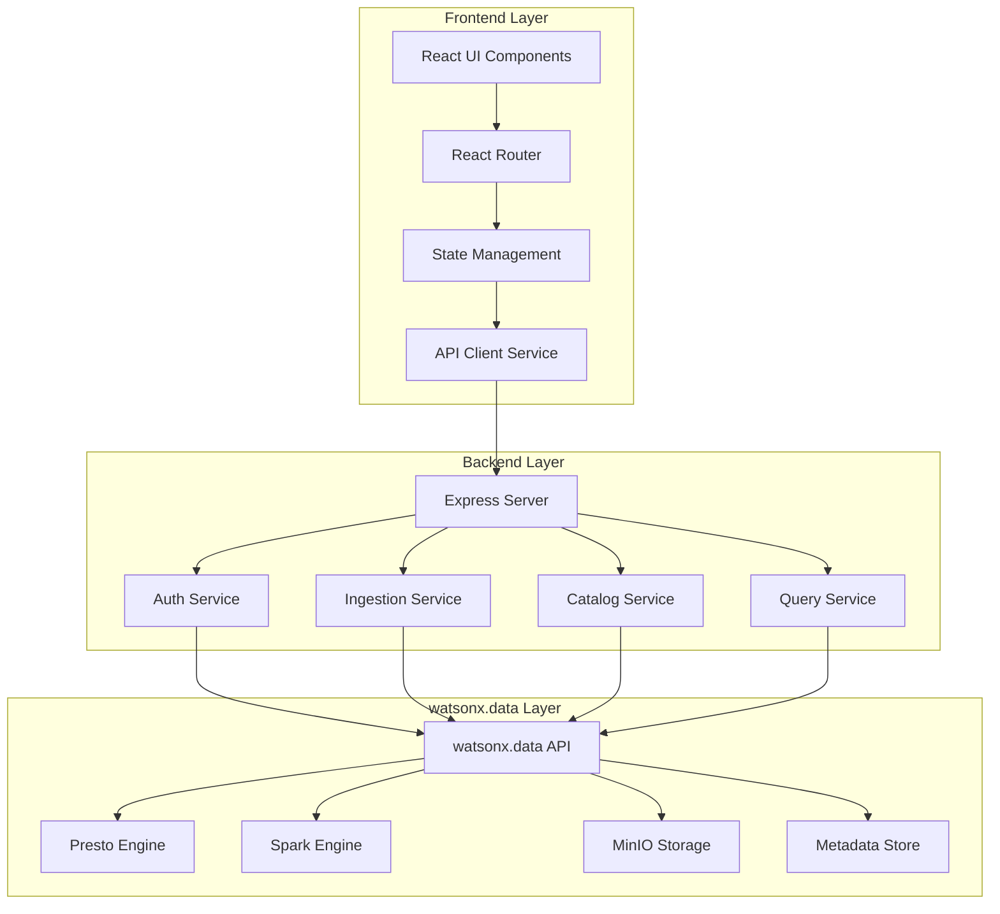
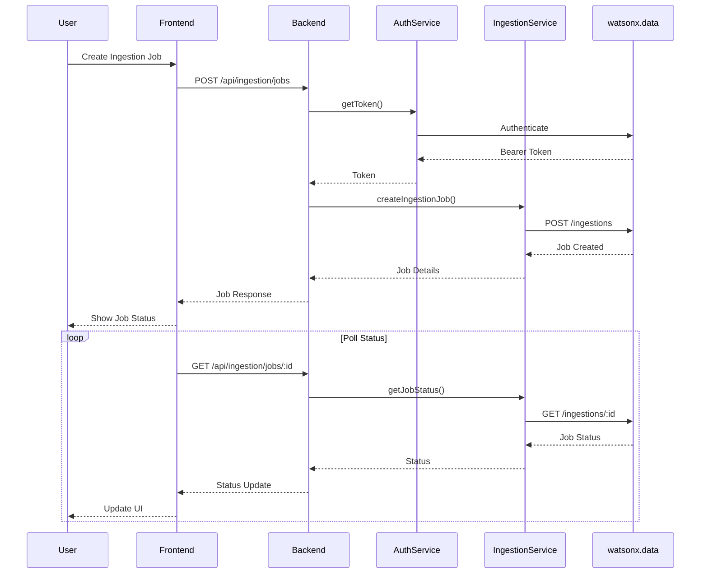
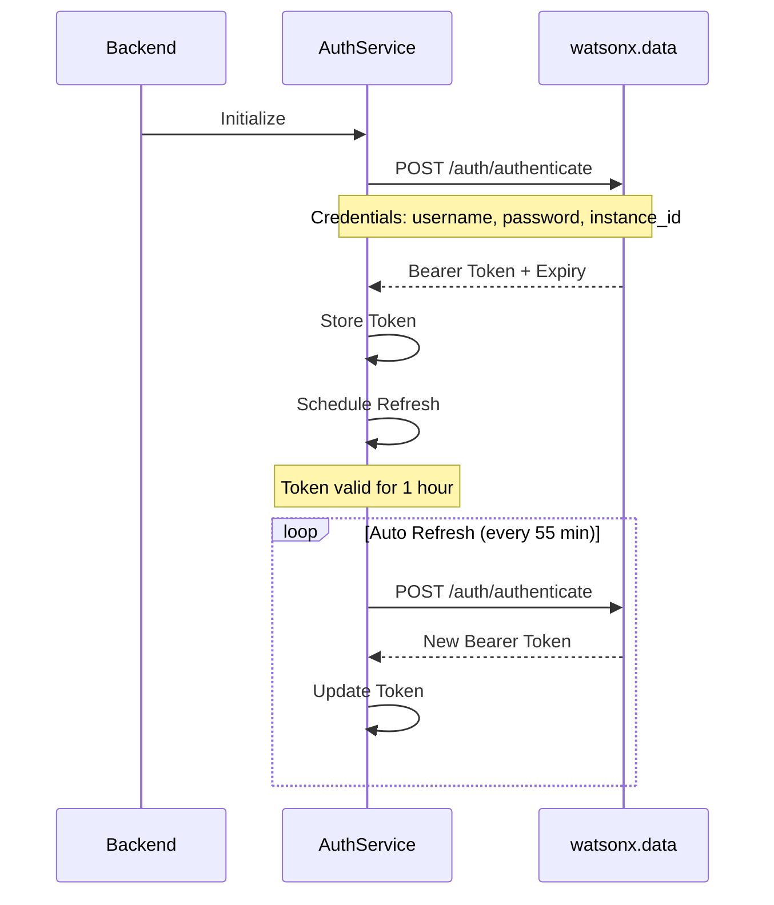

# watsonx.data Demo Application - Architecture Documentation

## Table of Contents
1. [Overview](#overview)
2. [System Architecture](#system-architecture)
3. [Component Details](#component-details)
4. [Data Flow](#data-flow)
5. [API Integration](#api-integration)
6. [Security](#security)
7. [Scalability](#scalability)

## Overview

The watsonx.data Demo Application is a full-stack web application designed to demonstrate the capabilities of IBM watsonx.data Developer Edition. It provides an intuitive interface for data ingestion, catalog management, and query execution.

### Technology Stack

**Backend:**
- Node.js v18+
- Express.js (REST API framework)
- Axios (HTTP client)
- Winston (Logging)
- Helmet (Security)

**Frontend:**
- React 18
- Material-UI (MUI)
- React Router (Navigation)
- Axios (API client)
- Recharts (Data visualization)

**Infrastructure:**
- watsonx.data Developer Edition
- MinIO (Object storage)
- Presto/Spark (Query engines)

## System Architecture

### High-Level Architecture

```
┌─────────────────────────────────────────────────────────────────┐
│                         Client Browser                          │
│                     (React Application)                         │
└────────────────────────────┬────────────────────────────────────┘
                             │ HTTP/HTTPS
                             │ Port 3000
                             │
┌────────────────────────────▼────────────────────────────────────┐
│                      Frontend Server                            │
│                    (React Dev Server)                           │
│  ┌──────────────────────────────────────────────────────────┐  │
│  │  Components:                                             │  │
│  │  - Dashboard    - Ingestion UI    - Job Monitor         │  │
│  │  - Catalog Mgmt - Query Interface - Settings            │  │
│  └──────────────────────────────────────────────────────────┘  │
└────────────────────────────┬────────────────────────────────────┘
                             │ REST API
                             │ Port 5000
                             │
┌────────────────────────────▼────────────────────────────────────┐
│                       Backend API Server                        │
│                      (Express.js/Node.js)                       │
│  ┌──────────────────────────────────────────────────────────┐  │
│  │  Services:                                               │  │
│  │  - Auth Service      - Ingestion Service                │  │
│  │  - Catalog Service   - Query Service                    │  │
│  │  - Monitoring Service                                   │  │
│  └──────────────────────────────────────────────────────────┘  │
│  ┌──────────────────────────────────────────────────────────┐  │
│  │  Middleware:                                             │  │
│  │  - Authentication    - Rate Limiting                    │  │
│  │  - Error Handling    - Request Logging                 │  │
│  └──────────────────────────────────────────────────────────┘  │
└────────────────────────────┬────────────────────────────────────┘
                             │ HTTPS/REST
                             │ Port 6443
                             │
┌────────────────────────────▼────────────────────────────────────┐
│                  watsonx.data Developer Edition                 │
│  ┌──────────────────────────────────────────────────────────┐  │
│  │  Core Components:                                        │  │
│  │  - Presto Engine     - Spark Engine                     │  │
│  │  - Iceberg Catalog   - Hive Catalog                     │  │
│  │  - MinIO Storage     - Metadata Service                 │  │
│  └──────────────────────────────────────────────────────────┘  │
└─────────────────────────────────────────────────────────────────┘
```

### Component Architecture



## Component Details

### Frontend Components

#### 1. Dashboard Component
- **Purpose**: Main landing page showing system overview
- **Features**:
  - System health status
  - Recent ingestion jobs
  - Quick actions
  - Performance metrics

#### 2. Ingestion Component
- **Purpose**: Create and manage data ingestion jobs
- **Features**:
  - File upload interface
  - S3/MinIO path configuration
  - Target catalog/schema/table selection
  - Engine configuration
  - Job submission and tracking

#### 3. Jobs Component
- **Purpose**: Monitor ingestion job status
- **Features**:
  - Job list with filtering
  - Real-time status updates
  - Job details view
  - Cancel job functionality
  - Job logs viewer

#### 4. Layout Component
- **Purpose**: Application shell and navigation
- **Features**:
  - Top navigation bar
  - Side menu
  - User profile
  - Theme toggle

### Backend Services

#### 1. Authentication Service
```javascript
class AuthService {
  - generateToken()      // Generate bearer token
  - getToken()          // Get valid token
  - refreshToken()      // Refresh expired token
  - invalidateToken()   // Logout
  - scheduleRefresh()   // Auto-refresh
}
```

**Responsibilities:**
- Authenticate with watsonx.data API
- Manage bearer token lifecycle
- Automatic token refresh
- Token validation

#### 2. Ingestion Service
```javascript
class IngestionService {
  - createIngestionJob()    // Create new job
  - getJobStatus()          // Get job status
  - listJobs()              // List all jobs
  - cancelJob()             // Cancel running job
  - validateConfig()        // Validate configuration
}
```

**Responsibilities:**
- Create and manage ingestion jobs
- Validate ingestion configurations
- Monitor job progress
- Handle job cancellation

#### 3. Catalog Service (Future)
```javascript
class CatalogService {
  - listCatalogs()          // List all catalogs
  - createCatalog()         // Create new catalog
  - listSchemas()           // List schemas
  - createSchema()          // Create schema
  - listTables()            // List tables
}
```

#### 4. Query Service (Future)
```javascript
class QueryService {
  - executeQuery()          // Execute SQL query
  - getQueryStatus()        // Get query status
  - getQueryResults()       // Get query results
  - cancelQuery()           // Cancel query
}
```

## Data Flow

### Ingestion Job Flow



### Authentication Flow



## API Integration

### watsonx.data API Endpoints

#### Authentication
```
POST /lakehouse/api/v3/auth/authenticate
Headers:
  Content-Type: application/json
Body:
  {
    "username": "ibmlhadmin",
    "password": "password",
    "instance_id": "0000-0000-0000-0000",
    "instance_name": ""
  }
Response:
  {
    "token": "eyJhbGc...",
    "expires_in": 3600
  }
```

#### Ingestion
```
POST /lakehouse/api/v3/lhingestion/api/v1/ingestions
Headers:
  Authorization: Bearer <token>
  Authinstanceid: 0000-0000-0000-0000
  Content-Type: application/json
Body:
  {
    "target": {
      "catalog": "iceberg_data",
      "schema": "schema1",
      "table": "table1"
    },
    "source": {
      "file_paths": "s3://bucket/path/file.json",
      "file_type": "json",
      "bucket_details": {
        "bucket_name": "bucket",
        "bucket_type": "minio"
      }
    },
    "job_id": "job-123",
    "engine_id": "spark158",
    "execute_config": {
      "driver_memory": "4G",
      "driver_cores": 2,
      "executor_memory": "4G",
      "executor_cores": 2,
      "num_executors": 1
    }
  }
```

### Backend API Endpoints

#### Authentication
- `POST /api/auth/login` - Generate token
- `POST /api/auth/refresh` - Refresh token
- `GET /api/auth/status` - Get auth status
- `POST /api/auth/logout` - Logout

#### Ingestion
- `POST /api/ingestion/jobs` - Create job
- `GET /api/ingestion/jobs` - List jobs
- `GET /api/ingestion/jobs/:id` - Get job status
- `DELETE /api/ingestion/jobs/:id` - Cancel job
- `GET /api/ingestion/config/default` - Get default config
- `GET /api/ingestion/file-types` - Get supported file types
- `POST /api/ingestion/validate` - Validate config

## Security

### Authentication & Authorization
- Bearer token-based authentication
- Automatic token refresh
- Secure credential storage
- HTTPS for all API calls

### Security Middleware
- **Helmet**: Security headers
- **CORS**: Cross-origin resource sharing
- **Rate Limiting**: Prevent abuse
- **Input Validation**: Joi schemas

### Best Practices
- Environment variables for sensitive data
- No hardcoded credentials
- SSL/TLS for production
- Regular security updates

## Scalability

### Horizontal Scaling
- Stateless backend design
- Load balancer ready
- Session-less architecture

### Performance Optimization
- Connection pooling
- Request caching
- Lazy loading
- Code splitting

### Monitoring
- Winston logging
- Health check endpoints
- Error tracking
- Performance metrics

## Deployment Architecture

### Development
```
localhost:3000 (Frontend) → localhost:5000 (Backend) → localhost:6443 (watsonx.data)
```

### Production
```
[Load Balancer] → [Frontend Servers] → [Backend Servers] → [watsonx.data Cluster]
```

## Future Enhancements

1. **Catalog Management**
   - Full CRUD operations
   - Schema visualization
   - Table metadata viewer

2. **Query Interface**
   - SQL editor with syntax highlighting
   - Query history
   - Result export

3. **Monitoring Dashboard**
   - Real-time metrics
   - Resource utilization
   - Performance analytics

4. **User Management**
   - Multi-user support
   - Role-based access control
   - Audit logging

5. **Advanced Features**
   - Scheduled ingestion
   - Data quality checks
   - Automated workflows
   - Integration with other IBM services